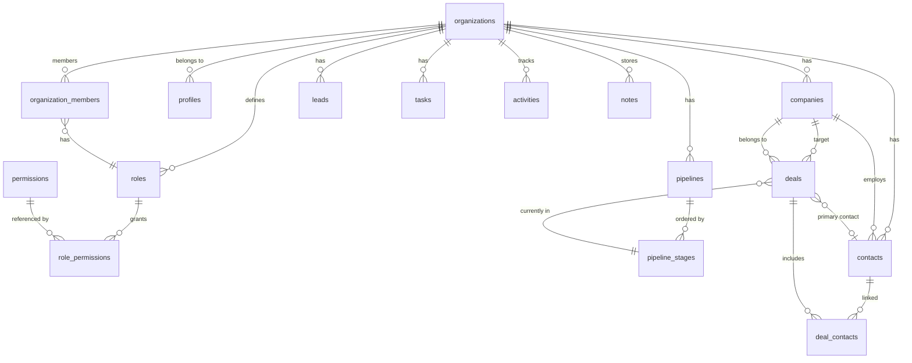

# Step 51 — Supabase Database

The CRM's real-data foundation: an org-scoped relational schema, row-level
security, server-side data layer, and authenticated UX. This document explains
how it fits together. Everything under `supabase/migrations/` applies in order
via `supabase db push` (or the Supabase SQL editor).

## Roles and clients

| File | Role | Notes |
| --- | --- | --- |
| `lib/supabase/client.ts` | Browser (anon key) | Session-aware singleton |
| `lib/supabase/server.ts` | Server (anon key) | Reads/writes cookies, SSR |
| `lib/supabase/admin.ts` | Server only (service role) | Bypasses RLS — never import into client code |
| `lib/supabase/middleware.ts` | Edge | Session refresh + route guard |

`lib/env.ts` exposes `isSupabaseConfigured()` (empty env = not configured). In
that mode the middleware is a no-op, auth pages still render, and the CRM
pages fall back to the existing mock data so the app keeps working without a
project.

## Multitenancy

Every business table carries `organization_id uuid not null references
organizations(id) on delete cascade`. Each user belongs to (at least) one
organization through `organization_members`.

- `current_organization_id()` — security-definer helper that returns the
  caller's active org id (single membership = that org).
- `is_organization_member(org_id)` — membership gate used by RLS.
- `has_permission(permission, org_id)` — checks `role_permissions` for the
  caller's role.
- `ensureWorkspace()` (server) + `create_workspace` RPC — idempotent
  onboarding: org + profile + Admin role (all permission keys) + membership +
  Main Sales Pipeline with 7 stages (New 10 / Discovery 25 / Qualified 50 /
  Proposal 70 / Negotiation 85 / Won 100 / Lost 0). Called from
  `/auth/callback`, `/api/auth/onboard` and on demand.

## Security model

- RLS is enabled on **all** public tables (migration `...07_rls_policies.sql`).
- Standard org-scoped policies: members can SELECT / INSERT / UPDATE rows of
  their org; DELETE is additionally gated by the matching permission
  (lead.delete, contact.delete, …) and is only defined where deletion is
  allowed. Other tables (tasks, deals, etc.) use soft delete
  (`archived_at`/`archived_by`) with a member-scoped UPDATE policy.
- Special cases: `profiles` (own profile select/update; org members may read
  org profiles), `organizations` (member-scoped select via
  `is_organization_member`), `organization_members`, `roles`,
  `role_permissions`, teams and invites (member/owner rules), `notifications`
  (own), `audit_logs` (`audit.view`), AI tables (member + `ai.manage`).
- `document_sequences` has **no** user policies — numbers are issued by the
  security-definer `next_document_number()` + BEFORE INSERT triggers
  (`set_quote_number`, `set_invoice_number`, `set_ticket_number`) → QUO-000001,
  INV-000001, TKT-000001 per org.
- Function permissions: helpers are `security definer` with
  `set search_path = public` and explicit `revoke` on default role list.

## Key flows

**Lead conversion** (Step 52/57) — `convert_lead(p_lead_id)` RPC in a single
transaction:
1. reads the lead (no lock on skip-inactive),
2. creates/links a company (by name+org, or creates), creates a contact,
3. moves the lead to stage Qualified + a new deal in that pipeline stage,
4. stamps `converted_deal_id / converted_at`, writes audit + activity rows.

**Stage move** — `move_deal_stage(p_deal_id, p_stage_id, p_apply_probability)`:
updates the stage, applies the stage's default probability (optional), sets
`won_at`/`lost_at` when entering Won/Lost, touches `last_activity_at`.

**Document numbers** — `next_document_number(p_org, p_prefix)` selects-for-
update the org sequence row and returns `PREFIX-000001` style tokens.

## ERD (core)

## Modules ↔ tables

| App module | Table(s) | Server module |
| --- | --- | --- |
| Leads | `leads`, `notes`, `activities` | `lib/crm/leads.ts` |
| Contacts | `contacts`, `companies` | `lib/crm/contacts.ts` |
| Companies | `companies` | `lib/crm/companies.ts` |
| Deals / Pipeline | `deals`, `pipelines`, `pipeline_stages`, `deal_contacts` | `lib/crm/deals.ts` |
| Tasks | `tasks` | `lib/crm/tasks.ts` |
| Dashboard | aggregates over leads/deals/tasks/meetings | `lib/crm/dashboard.ts` |
| Auth / Onboarding | `organizations`, `profiles`, `organization_members`, `roles`, `role_permissions` | `lib/crm/workspace.ts`, `lib/crm/user-context.ts` |

## Bootstrap a real workspace

1. Create a Supabase project (or `supabase link`).
2. Push migrations: `supabase db push` (or paste the `.sql` files into the
   SQL editor in order).
3. `cp .env.example .env.local` and fill in
   `NEXT_PUBLIC_SUPABASE_URL`, the publishable key
   (`NEXT_PUBLIC_SUPABASE_PUBLISHABLE_KEY`, or legacy
   `NEXT_PUBLIC_SUPABASE_ANON_KEY`), the secret key
   (`SUPABASE_SECRET_KEY`, or legacy `SUPABASE_SERVICE_ROLE_KEY`), and
   `NEXT_PUBLIC_APP_URL`.
4. Optional demo data: `node scripts/seed.mjs` (`--reset` to reseed).
5. Sign up at `/signup` — `create_workspace` runs on confirm and creates the
   workspace + Main Sales Pipeline.